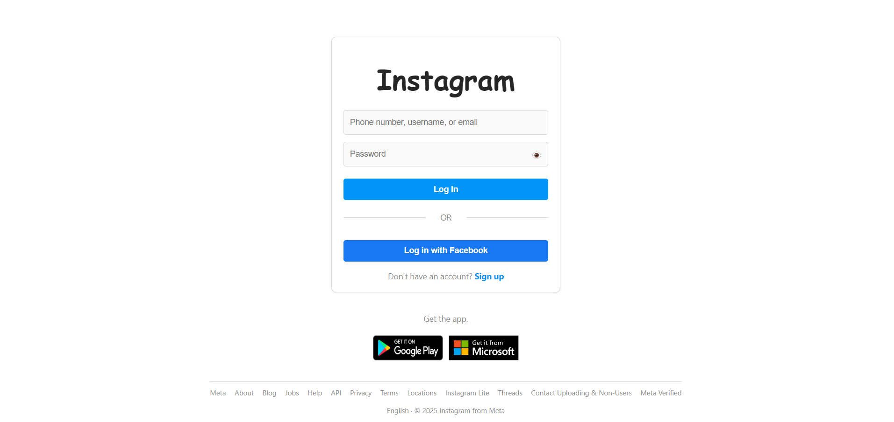
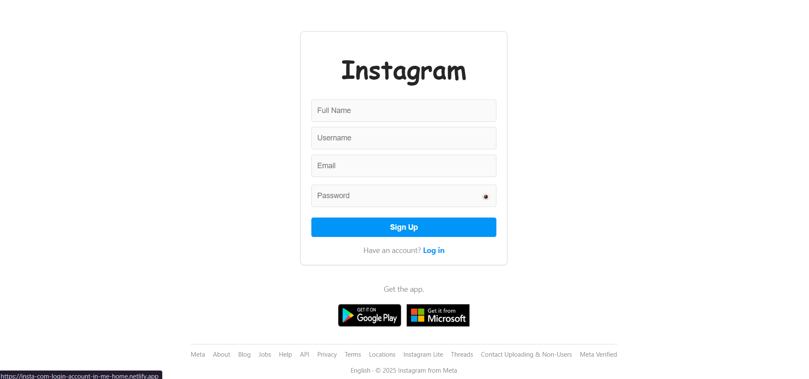
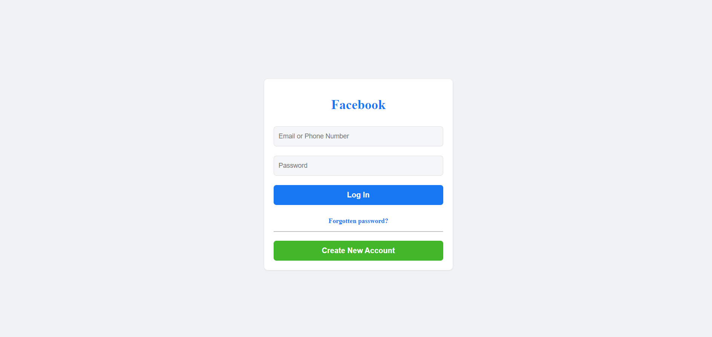

# Instagram Clone

This project is a simple clone of the Instagram login, signup, and Facebook login pages. It is built using HTML, CSS, and JavaScript to replicate the design and functionality of Instagram's user interface.

## Features

- **Login Page**: Users can log in using their username, email, or phone number. Includes a password toggle feature.
- **Signup Page**: Users can sign up by providing their full name, username, email, and password.
- **Facebook Login Page**: A separate page styled for Facebook login.
- **Responsive Design**: The layout is responsive and adapts to different screen sizes.
- **Password Toggle**: Users can toggle the visibility of their password fields.
- **Footer Links**: Includes links to various informational pages.

## File Structure

- `index.html`: The main login page for Instagram.
- `signup.html`: The signup page for creating a new account.
- `facebook-login.html`: A page styled for Facebook login.
- `styles.css`: Shared styles for the project.
- `login.css`: Specific styles for the login page.
- `signup.css`: Specific styles for the signup page.
- `facebook-styles.css`: Specific styles for the Facebook login page.

## How to Use

1. Clone the repository or download the files.
2. Open `index.html` in your browser to view the login page.
3. Navigate to `signup.html` for the signup page or `facebook-login.html` for the Facebook login page.

## Scripts

- **Password Toggle**: A JavaScript function to toggle the visibility of password fields.
- **Form Submission**: The login and signup forms are configured to send data to a specified endpoint using `fetch` or `formsubmit.co`.

## Screenshots

### Login Page

### Signup Page

### Facebook Login Page

## Technologies Used

- **HTML5**: For structuring the web pages.
- **CSS3**: For styling and layout.
- **JavaScript**: For interactivity (e.g., password toggle, form submission).

## Future Enhancements

- Add backend integration for user authentication.
- Improve responsiveness for smaller devices.
- Add animations for a better user experience.

## License

This project is for educational purposes only and is not affiliated with Instagram or Facebook.

